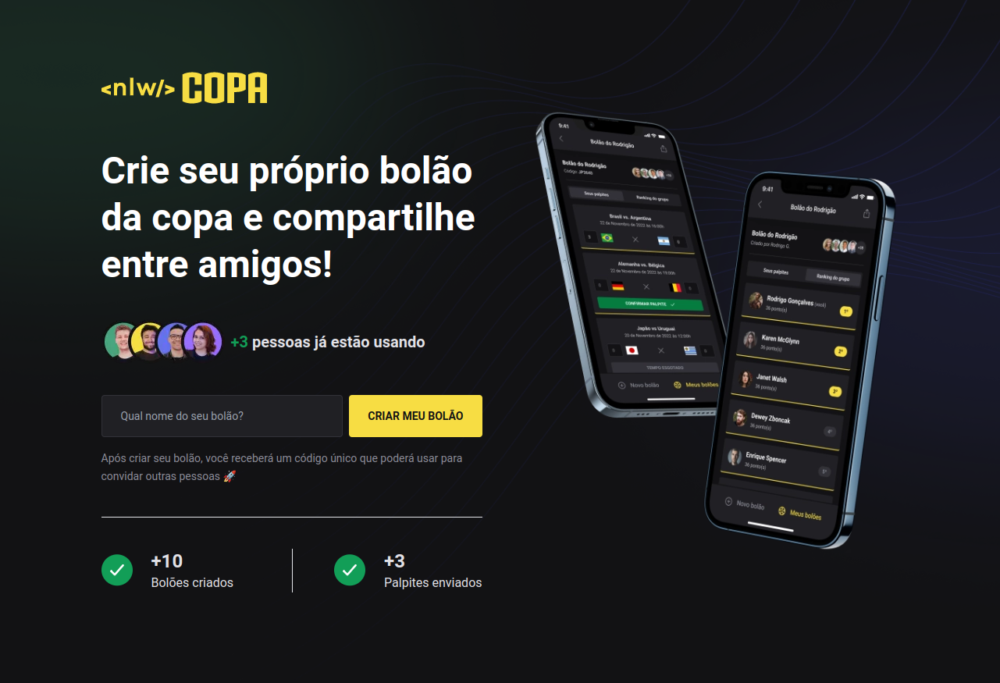
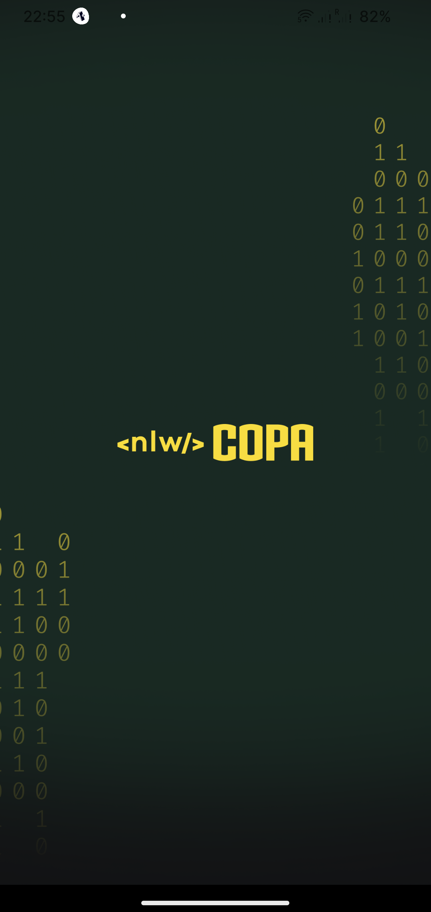
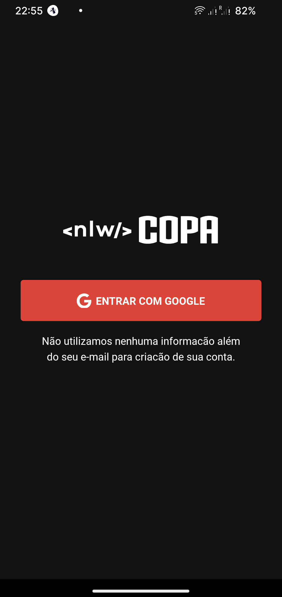
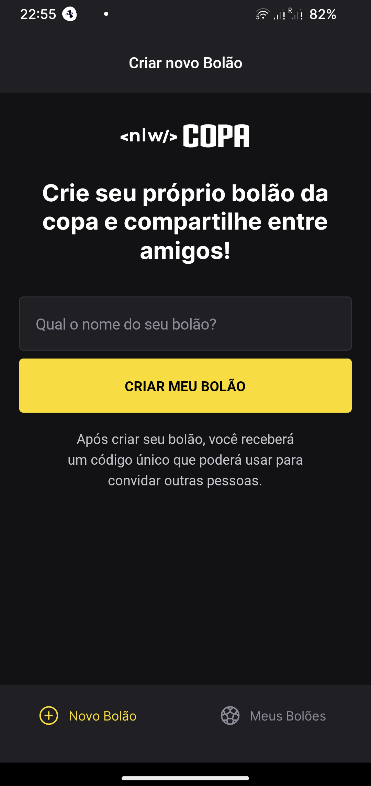
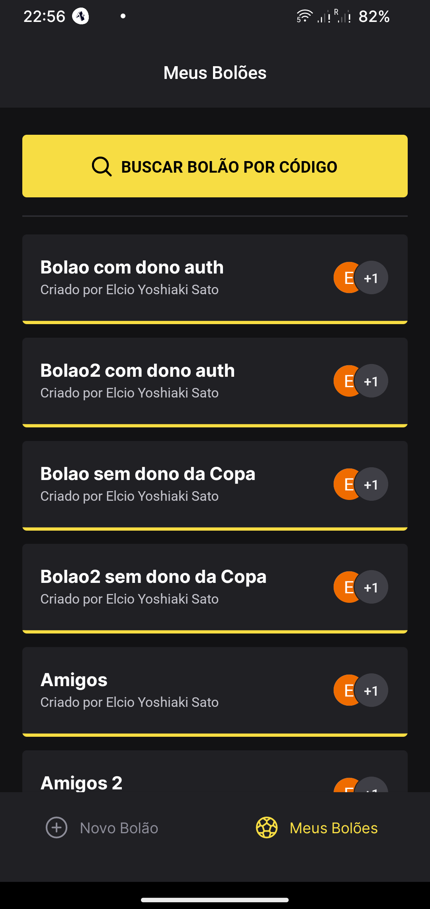
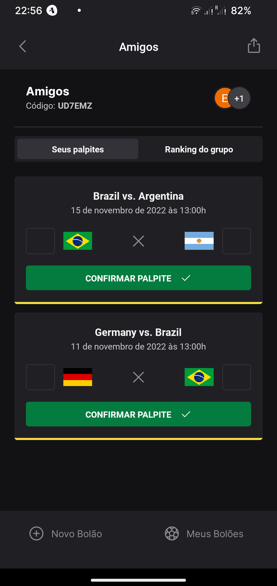
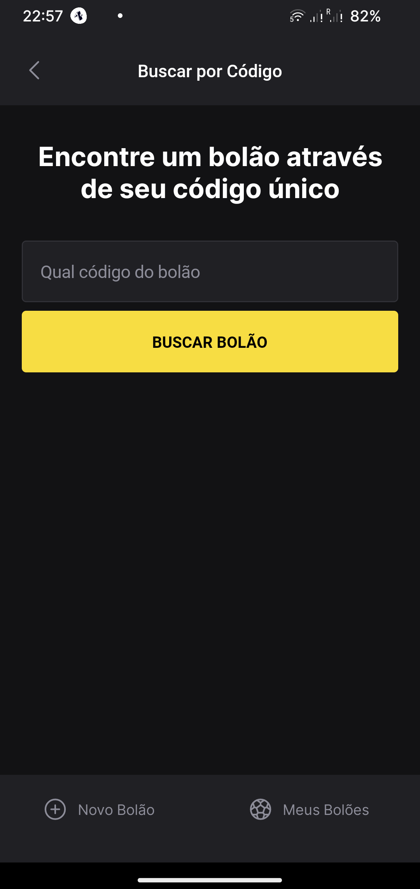

# NLW10 - World Cup 2022

> Trilha Ignite - Bolão

Projeto desenvolvida durante o evento NLW10 Copa 2022 da Rocketseat.

Consiste numa aplicacão backend Node.js, uma versão Frontend React/Next.js e versão mobile React Native.

Principais funcionalidades:

- Criar Bolão
- Autenticacão conta Google (Oath) - versão mobile
- Listar seus Bolões
- Visualizar número de participantes
- Participar de um Bolão através do seu código
- Buscar Bolão por código

## Backend

Principais tecnologias utilizadas na construcão do Backend:

- Node.js
- Typescript
- Fastify
- JWT
- Prisma
- SQLite

## Frontend

Principais tecnologias utilizadas na construcão do Frontend:

- React
- Next.js
- Typescript

## Mobile

  
  
  
  
  
  

Principais tecnologias utilizadas na construcão da versão mobile:

- React Native
- Expo
- Typescript
- Google Oauth
- axios
- dotenv
- dayjs

## Contato

elciosato@gmail.com
